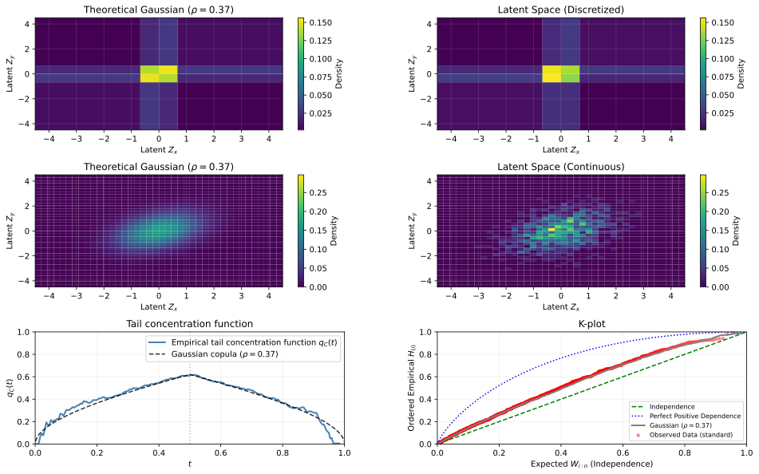

[](https://github.com/PavelNovikov/latentmetrics/actions/workflows/tests.yml)

# Latent Correlation Estimation Package

This package provides **minimalistic implementations of latent correlation estimators** between pairs of continuous variables when one or both variables are **discretized**. 

The main goal is to offer **both value-based and rank-based correlation estimates in one place**, with a **simple and easy-to-understand implementation**.

> Note: Binary data is a special case of ordinal data. For clarity, we implemented binary correlations separately as a simpler example.

## Supported Estimators

### 1. Value-Based Correlations
- **Tetrachoric**
- **Polychoric**
- **Biserial**
- **Polyserial**

These estimators assume a **bivariate normal underlying distribution** and estimate the correlation parameter ($\rho$) by **maximizing the likelihood** of the observed discretized data.

### 2. Rank-Based Correlations
- Suitable for **binary, ordinal, and mixed (ordinal-continuous) data**, and also supports **continuous data** through **Greiner's formula**.
- Based on the assumption that data arises from an **arbitrary monotonic transformation** of underlying bivariate Gaussian variables (Gaussian copula model).
- The correlation parameter ($\rho$) is estimated by **matching the observed Kendall's tau** to its expected value as a function of $\rho$. This makes these estimators invariant to marginal transformations.

---

## Synthetic Data Scenarios

The package includes utilities for generating synthetic data to test estimator robustness across different distributional assumptions:

1.  **Normal Distribution**: Satisfies the underlying assumptions for both value-based and rank-based methods.
2.  **Lognormal Distribution**: Violates the assumptions of value-based methods due to non-normality, but holds for rank-based methods.
3.  **Gumbel and Clayton Copulas**: Violate the assumptions of both families of estimators due to the presence of tail dependence, which deviates from the Gaussian copula model.

---

## Diagnostics & Model Fit

To verify if the data aligns with the theoretical assumptions of the Gaussian copula model, the package provides tools to visualize and compare the observed data against theoretical expectations:

1.  **Tail Concentration Function**: (For continuous data) Helps detect if dependence is concentrated in the tails, which would contradict a Gaussian assumption.
2.  **K-plot (Kendall plot)**: (For continuous data) A diagnostic tool to assess the dependency structure independently of marginal distributions.
3.  **Latent Space Comparison**: For both continuous and discrete data, the package allows for a direct visual check of the Gaussian copula assumption. This is done by comparing 2D histograms or empirical categorical densities against the theoretical densities expected under the estimated latent correlation. The comparison is performed in the latent space by mapping observed data via rank transformation.

## Diagnostics & Model Fit

To verify whether the data aligns with the theoretical assumptions of the Gaussian copula, the package provides tools to visualize and compare observed data against theoretical expectations:

1.  **Tail Concentration Function** (Continuous data): Detects whether dependence is concentrated in the extremes (tails), which would indicate a departure from Gaussian assumptions.
2.  **K-plot (Kendall Plot)** (Continuous data): A diagnostic tool used to assess the underlying dependency structure independently of the marginal distributions.
3.  **Latent Space Comparison** (Mixed data types): Facilitates a direct visual check of the Gaussian copula assumption by comparing observed 2D histograms or empirical categorical densities against theoretical densities. This is achieved by mapping observed data into the latent space via rank transformation to evaluate the estimated latent correlation.

To numerically evaluate model fit, the package implements two classes of goodness-of-fit tests:

* **Parametric Bootstrap Tests**: Robust but computationally intensive.
* **Asymptotic Distribution Tests**: Significantly faster, though potentially less reliable for small sample sizes.

Both categories include specialized tests for **continuous** and **ordinal** data, as well as a **mixed-data** test that discretizes continuous variables to leverage ordinal testing frameworks.


---


## Installation

```bash
pip install latentmetrics[all]
```

## Usage

```python
import matplotlib.pyplot as plt
from latentmetrics import (
    make_corr_fn,
    VariableType,
    EstimateMethod,
    gauss_rho_to_tau,
)
from latentmetrics.synthesis import Synthesis
from latentmetrics.diagnostics import (
    plot_tail_concentration_function,
    plot_k_plot,
    plot_latent_density,
    get_par_bootstrap_gof_fn,
    get_asymptotic_gof_fn,
)

# =============================================================================
# Configuration
# =============================================================================

N_SAMPLES = 2000
RHO_TRUE = 0.4

probs_x = [0.25, 0.25, 0.25, 0.25]
probs_y = [0.25, 0.25, 0.25, 0.25]

# =============================================================================
# Data Synthesis
# =============================================================================

# Alternative copulas (commented out)
# x, y = Synthesis.gumbel(tau=gauss_rho_to_tau(RHO_TRUE), n=N_SAMPLES)
# x, y = Synthesis.clayton(tau=gauss_rho_to_tau(RHO_TRUE), n=N_SAMPLES)

# Lognormal latent variables
x, y = Synthesis.lognormal(rho=RHO_TRUE, n=N_SAMPLES)

# Discretize latent variables into ordinal observations
x_obs = Synthesis.discretize(x, probs_x)
y_obs = Synthesis.discretize(y, probs_y)

# =============================================================================
# Correlation Estimation
# =============================================================================

corr_fn = make_corr_fn(
    VariableType.ORDINAL,
    VariableType.ORDINAL,
    method=EstimateMethod.RANK,
)

rho_est = corr_fn(x_obs, y_obs).estimate

# =============================================================================
# Goodness-of-Fit Testing (Gaussian Copula)
# =============================================================================

def generate_fn(rho, n, rng):
    """
    Generate bootstrap samples from the hypothesized Gaussian copula,
    followed by discretization.
    """
    x_boot, y_boot = Synthesis.normal(
        rho=RHO_TRUE,
        n=N_SAMPLES,
        seed=rng,
    )
    x_boot_obs = Synthesis.discretize(x_boot, probs_x)
    y_boot_obs = Synthesis.discretize(y_boot, probs_y)
    return x_boot_obs, y_boot_obs


def fit_fn(x, y):
    """Estimate the correlation parameter from observed data."""
    return corr_fn(x, y).estimate


# Parametric bootstrap-based goodness-of-fit test
bootstrap_test_fn = get_par_bootstrap_gof_fn(
    VariableType.ORDINAL,
    VariableType.ORDINAL,
)

p_value = bootstrap_test_fn(
    x_obs,
    y_obs,
    fit_fn=fit_fn,
    generate_fn=generate_fn,
)

print(f"Parametric bootstrap GOF p-value (Gaussian copula): {p_value:.4f}")


# Asymptotic goodness-of-fit test
asymptotic_test_fn = get_asymptotic_gof_fn(
    VariableType.ORDINAL,
    VariableType.ORDINAL,
)

asymptotic_p_value = asymptotic_test_fn(x_obs, y_obs)
print(f"Asymptotic GOF p-value (Gaussian copula): {asymptotic_p_value:.4f}")

# =============================================================================
# Visualization
# =============================================================================

fig, axs = plt.subplots(3, 2, figsize=(16, 18))

# 1. Latent density (discretized observations)
plot_latent_density(
    x_obs,
    y_obs,
    title="Latent Space (Discretized)",
    rho=rho_est,
    ax_theoretical=axs[0, 0],
    ax_empirical=axs[0, 1],
)

# 2. Latent density (continuous latent variables)
plot_latent_density(
    x,
    y,
    title="Latent Space (Continuous)",
    rho=rho_est,
    ax_theoretical=axs[1, 0],
    ax_empirical=axs[1, 1],
)

# 3. Tail concentration function and K-plot
plot_tail_concentration_function(
    x,
    y,
    rho=rho_est,
    ax=axs[2, 0],
)

plot_k_plot(
    x,
    y,
    rho=rho_est,
    mode="standard",
    ax=axs[2, 1],
)

# Layout adjustments
plt.subplots_adjust(hspace=0.4, wspace=0.3)
plt.show()
```


## Related Code Packages

If you are looking for alternative implementations or specialized features, you may find these packages useful:

### R Packages
- [polycor](https://cran.r-project.org/web/packages/polycor/index.html) – The established standard for Polychoric and Polyserial correlations in R. 
- [latentcor](https://cran.r-project.org/web/packages/latentcor/vignettes/latentcor.html) – Efficient implementations of rank-based correlations.
- [gofCopula](https://cran.r-project.org/web/packages/gofCopula/index.html) – A comprehensive suite of goodness-of-fit tests for validating copula models. 
- [copula](https://cran.r-project.org/web/packages/copula/index.html) – A foundational toolkit for constructing, simulating, and estimating a wide variety of multivariate dependence models.


### Python Packages
- [latentcor](https://pypi.org/project/latentcor/) – High-performance Python implementation of rank-based correlation by the authors of the R package with the same name.
- [semopy](https://pypi.org/project/semopy/) – Structural Equation Modeling (SEM) package; includes polychoric and polyserial correlations.
- [copulas](https://pypi.org/project/copulas/), [copul](https://pypi.org/project/copul/) – Packages for the analysis and generation of synthetic data using copula models.

## Literature & References

### Value-Based Correlations
- **Polychoric correlation** Olsson, U. (1979). *Maximum likelihood estimation of the polychoric correlation coefficient*. Psychometrika, 44(4), 443–460.  

- **Polyserial correlation** Olsson, U., Drasgow, F., & Dorans, N. J. (1982). *The polyserial correlation coefficient*. Psychometrika, 47(3), 337–347.  

### Rank-Based & Semiparametric Modeling
- Dey, D., & Zipunnikov, V. (2022). *Semiparametric Gaussian Copula Regression Modeling for Mixed Data Types (SGCRM)*. arXiv preprint arXiv:2205.06868.  

### Copula Theory & Background
- Durante, F., Fernández-Sánchez, J., & Pappadà, R. (2015). *Copulas, diagonals, and tail dependence*. Fuzzy Sets and Systems, 264, 22–41.

- Genest, C., & Favre, A. C. (2007). *Everything you always wanted to know about copula modeling but were afraid to ask*. Journal of Hydrologic Engineering, 12(4), 347–368.

- Hofert, M., Kojadinovic, I., Mächler, M., & Yan, J. (2018). *Elements of copula modeling with R*. Springer.

### Simulation & Data Synthesis
- Hofert, M. (2008). *Sampling Archimedean copulas*. Computational Statistics & Data Analysis, 52(12), 5163–5174.

### Goodness-of-Fit Tests for Copulas
- Genest, C., Rémillard, B., & Beaudoin, D. (2009). Goodness-of-fit tests for copulas: A review and a power study. Insurance: Mathematics and economics, 44(2), 199-213.

- Foldnes, N., & Grønneberg, S. (2020). Pernicious polychorics: The impact and detection of underlying non-normality.  Structural Equation Modeling: A Multidisciplinary Journal, 27(4), 525-543.

- Maydeu-Olivares, A., García-Forero, C., Gallardo-Pujol, D., & Renom, J. (2009). Testing categorized bivariate normality with two-stage polychoric correlation estimates. Methodology, 5(4), 131-136.

- Huang, W., & Prokhorov, A. (2014). A goodness-of-fit test for copulas. Econometric Reviews, 33(7), 751-771.


